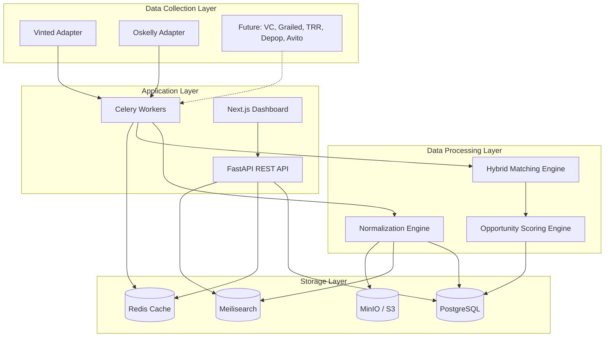
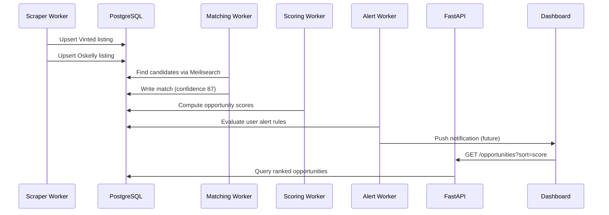

# System Architecture

## Overview

Lux Arbitrage is a multi-layer platform that ingests marketplace listings, normalizes product data, matches cross-market equivalents, scores arbitrage opportunities, and surfaces actionable intelligence through a dashboard and alert system.



## Component Responsibilities

### 1. Data Collection Layer

**Marketplace adapters** implement a common `MarketplaceAdapter` interface:

- `fetch_listings(brand, category, cursor)` — paginated listing ingestion
- `fetch_listing_detail(external_id)` — full listing metadata + images
- `normalize_raw(raw)` — platform-specific → canonical `ListingCreate`

MVP ships with **mock adapters** that generate realistic luxury fashion data. Production adapters use rate-limited HTTP clients with proxy rotation and respect robots.txt / ToS boundaries.

**Ingestion pipeline** (Celery queue: `scraping`):

1. Scheduler triggers brand/category crawl jobs every N minutes
2. Raw payloads stored in `listings.raw_data` JSONB
3. Images uploaded to S3; URLs stored in `listings.image_urls`
4. Dedup by `(marketplace_id, external_id)`
5. Price snapshots appended to `price_history`

### 2. Data Processing Layer

#### Normalization Engine

| Dimension | Strategy |
|-----------|----------|
| Brand | Alias table + fuzzy match against `brands.aliases` |
| Size | EU/US/UK/IT conversion tables per category (clothing, shoes, belts) |
| Currency | Live ECB/Frankfurter rates → EUR + RUB columns |
| Condition | Platform-specific → enum: `new`, `excellent`, `good`, `fair` |
| Category | Hierarchical taxonomy mapped to internal `products.category` |

#### Hybrid Matching Engine

Candidate generation (Meilisearch) → multi-signal scoring:

| Signal | Weight | Method |
|--------|--------|--------|
| Brand | 25% | Exact canonical brand match |
| Title | 25% | RapidFuzz token_set_ratio + embedding cosine |
| Image | 20% | CLIP embedding cosine (optional in MVP) |
| Category | 15% | Taxonomy path overlap |
| Size | 15% | Normalized size equality / adjacency |

Output: `match_confidence` 0–100. Threshold default: **72**.

#### Opportunity Scoring Engine

For each accepted match (Vinted buy → Oskelly sell):

```
purchase_cost = price + shipping + platform_fee + fx_cost + import_cost
expected_sale = median(oskelly_comparables) adjusted for condition
gross_profit = expected_sale - purchase_cost
roi = gross_profit / purchase_cost
```

Component scores feed the composite **Opportunity Score** (see SCORING.md).

### 3. Storage Layer

| Store | Purpose |
|-------|---------|
| PostgreSQL | Source of truth: users, listings, matches, opportunities, alerts |
| Redis | API response cache, rate limiting, Celery broker, session tokens |
| Meilisearch | Full-text + faceted search on listings and opportunities |
| S3/MinIO | Product images, embedding vectors (future) |

### 4. Application Layer

**FastAPI** exposes REST endpoints with JWT auth, OpenAPI docs, and async SQLAlchemy 2.0.

**Celery workers** handle:

- `scraping` — marketplace ingestion
- `matching` — batch match computation
- `scoring` — opportunity recalculation
- `alerts` — rule evaluation + notification dispatch
- `analytics` — nightly snapshot aggregation

**Next.js frontend** — server components for dashboard, client components for filters/charts.

## Scalability Path

| Phase | Listings | Architecture change |
|-------|----------|---------------------|
| MVP | ~10K | Single-node Docker Compose |
| Growth | ~500K | Read replicas, dedicated Meilisearch cluster |
| Scale | 1M+ | Marketplace-specific ingest shards, pg_partman on listings, embedding service on GPU |

## Security

- JWT access + refresh tokens (bcrypt password hashing)
- Row-level ownership on alerts/watchlists
- Admin routes behind `is_superuser` flag
- Secrets via environment variables / AWS Secrets Manager in production
- Image URLs signed for private buckets

## Deployment Targets

- **Development**: Docker Compose (this repo)
- **Staging/Prod**: AWS ECS or Railway with managed RDS, ElastiCache, and S3

## Event Flow: New Opportunity


