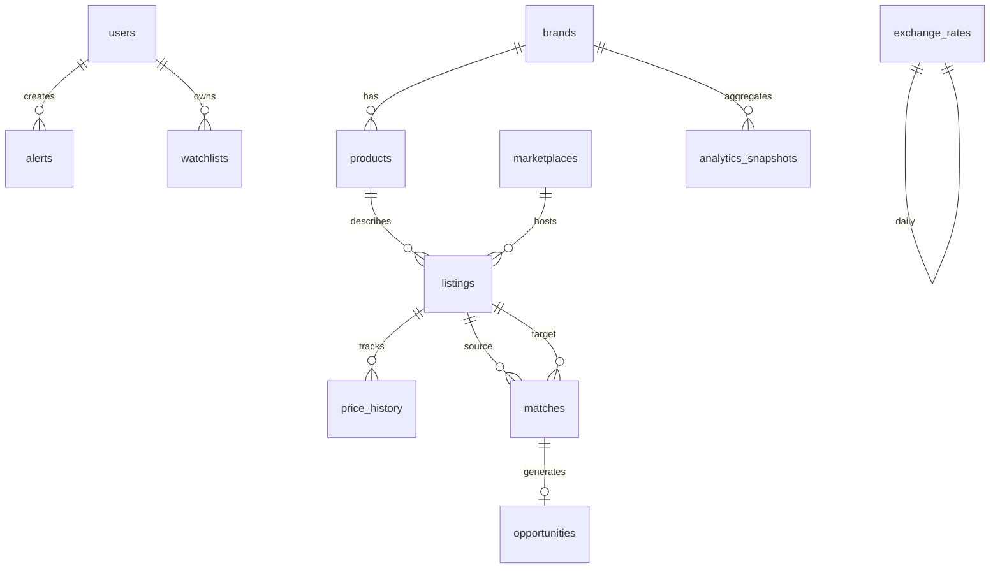

# Database Schema

PostgreSQL 16 with UUID primary keys, JSONB for flexible metadata, and partial indexes for hot query paths.

## Entity Relationship



## Tables

### users

| Column | Type | Notes |
|--------|------|-------|
| id | UUID PK | |
| email | VARCHAR UNIQUE | |
| hashed_password | VARCHAR | bcrypt |
| full_name | VARCHAR | |
| is_active | BOOLEAN | default true |
| is_superuser | BOOLEAN | default false |
| created_at | TIMESTAMPTZ | |
| updated_at | TIMESTAMPTZ | |

### marketplaces

| Column | Type | Notes |
|--------|------|-------|
| id | UUID PK | |
| slug | VARCHAR UNIQUE | vinted, oskelly, vestiaire, … |
| name | VARCHAR | Display name |
| base_currency | VARCHAR(3) | EUR for Vinted, RUB for Oskelly |
| buyer_fee_pct | NUMERIC(5,4) | Platform buyer fee |
| seller_fee_pct | NUMERIC(5,4) | Platform seller fee |
| default_shipping_eur | NUMERIC(10,2) | Estimated shipping |
| country_code | VARCHAR(2) | Primary market |
| is_active | BOOLEAN | |
| config | JSONB | Scraper settings |

### brands

| Column | Type | Notes |
|--------|------|-------|
| id | UUID PK | |
| canonical_name | VARCHAR UNIQUE | e.g. "Maison Margiela" |
| slug | VARCHAR UNIQUE | maison-margiela |
| aliases | TEXT[] | YSL, Saint Laurent, … |
| tier | VARCHAR | luxury, premium, streetwear |
| demand_score | NUMERIC(5,2) | 0–100, refreshed nightly |
| counterfeit_risk | NUMERIC(5,2) | 0–100 |
| metadata | JSONB | Logo URL, notes |

### products

| Column | Type | Notes |
|--------|------|-------|
| id | UUID PK | |
| brand_id | UUID FK → brands | |
| canonical_title | VARCHAR | Normalized product name |
| category | VARCHAR | bags, shoes, outerwear, … |
| subcategory | VARCHAR | crossbody, sneakers, … |
| model_line | VARCHAR | Optional: 5AC, Tabi, … |
| embedding | VECTOR(384) | Optional pgvector |
| metadata | JSONB | |

### listings

| Column | Type | Notes |
|--------|------|-------|
| id | UUID PK | |
| marketplace_id | UUID FK | |
| product_id | UUID FK nullable | Set after matching |
| brand_id | UUID FK | |
| external_id | VARCHAR | Platform listing ID |
| title | VARCHAR | Raw title |
| normalized_title | VARCHAR | Cleaned title |
| category | VARCHAR | |
| subcategory | VARCHAR | |
| size_raw | VARCHAR | Original size string |
| size_normalized | VARCHAR | EU standard |
| size_system | VARCHAR | EU, US, UK, IT |
| condition | VARCHAR | new, excellent, good, fair |
| price_original | NUMERIC(12,2) | |
| currency_original | VARCHAR(3) | |
| price_eur | NUMERIC(12,2) | Converted |
| price_rub | NUMERIC(12,2) | Converted |
| seller_country | VARCHAR(2) | |
| listing_url | TEXT | |
| image_urls | TEXT[] | |
| description | TEXT | |
| is_sold | BOOLEAN | default false |
| is_active | BOOLEAN | default true |
| listed_at | TIMESTAMPTZ | |
| scraped_at | TIMESTAMPTZ | |
| raw_data | JSONB | Original payload |
| UNIQUE(marketplace_id, external_id) | | |

**Indexes**: `(brand_id, is_active)`, `(price_eur)`, GIN on `normalized_title` via Meilisearch sync.

### matches

| Column | Type | Notes |
|--------|------|-------|
| id | UUID PK | |
| source_listing_id | UUID FK | Typically Vinted (buy side) |
| target_listing_id | UUID FK | Typically Oskelly (sell side) |
| match_confidence | NUMERIC(5,2) | 0–100 |
| brand_score | NUMERIC(5,2) | Component |
| title_score | NUMERIC(5,2) | Component |
| image_score | NUMERIC(5,2) | Component |
| category_score | NUMERIC(5,2) | Component |
| size_score | NUMERIC(5,2) | Component |
| match_method | VARCHAR | hybrid, manual |
| is_verified | BOOLEAN | Human confirmed |
| created_at | TIMESTAMPTZ | |
| UNIQUE(source_listing_id, target_listing_id) | | |

### opportunities

| Column | Type | Notes |
|--------|------|-------|
| id | UUID PK | |
| match_id | UUID FK UNIQUE | |
| purchase_listing_id | UUID FK | |
| sale_listing_id | UUID FK | |
| purchase_cost_eur | NUMERIC(12,2) | All-in buy cost |
| expected_sale_price_eur | NUMERIC(12,2) | |
| expected_sale_price_rub | NUMERIC(12,2) | |
| gross_profit_eur | NUMERIC(12,2) | |
| net_profit_eur | NUMERIC(12,2) | After all fees |
| roi | NUMERIC(8,4) | |
| roi_score | NUMERIC(5,2) | 0–100 |
| demand_score | NUMERIC(5,2) | |
| liquidity_score | NUMERIC(5,2) | |
| price_gap_score | NUMERIC(5,2) | |
| risk_score | NUMERIC(5,2) | |
| opportunity_score | NUMERIC(5,2) | Composite |
| recommendation | VARCHAR | BUY, WATCH, SKIP |
| cost_breakdown | JSONB | Line-item costs |
| computed_at | TIMESTAMPTZ | |
| expires_at | TIMESTAMPTZ | When listing likely gone |

### price_history

| Column | Type | Notes |
|--------|------|-------|
| id | UUID PK | |
| listing_id | UUID FK | |
| price_eur | NUMERIC(12,2) | |
| price_rub | NUMERIC(12,2) | |
| recorded_at | TIMESTAMPTZ | |

### exchange_rates

| Column | Type | Notes |
|--------|------|-------|
| id | UUID PK | |
| base_currency | VARCHAR(3) | EUR |
| target_currency | VARCHAR(3) | RUB, USD, GBP |
| rate | NUMERIC(18,8) | |
| fetched_at | TIMESTAMPTZ | |
| UNIQUE(base_currency, target_currency, fetched_at::date) | | |

### alerts

| Column | Type | Notes |
|--------|------|-------|
| id | UUID PK | |
| user_id | UUID FK | |
| name | VARCHAR | User label |
| rule_type | VARCHAR | roi, price_gap, brand_price, custom |
| conditions | JSONB | e.g. `{"roi_min": 0.8, "brand": "prada"}` |
| is_active | BOOLEAN | |
| last_triggered_at | TIMESTAMPTZ | |
| created_at | TIMESTAMPTZ | |

### watchlists

| Column | Type | Notes |
|--------|------|-------|
| id | UUID PK | |
| user_id | UUID FK | |
| opportunity_id | UUID FK nullable | |
| listing_id | UUID FK nullable | |
| notes | TEXT | |
| created_at | TIMESTAMPTZ | |

### analytics_snapshots

| Column | Type | Notes |
|--------|------|-------|
| id | UUID PK | |
| snapshot_date | DATE | |
| entity_type | VARCHAR | brand, category, marketplace |
| entity_id | UUID | |
| metrics | JSONB | avg prices, median spread, ROI, trends |
| created_at | TIMESTAMPTZ | |

## Migrations

Alembic manages schema evolution. Initial migration creates all tables + seed marketplaces/brands.

```bash
alembic upgrade head
```

## Future: pgvector

For production embedding search at scale, enable the `vector` extension:

```sql
CREATE EXTENSION IF NOT EXISTS vector;
ALTER TABLE products ADD COLUMN embedding vector(384);
CREATE INDEX ON products USING ivfflat (embedding vector_cosine_ops);
```

MVP uses Meilisearch + RapidFuzz; pgvector is optional upgrade path.
