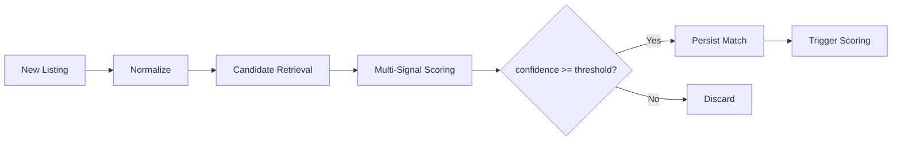

# Matching Engine Design

## Objective

Match listings across marketplaces that represent the **same or highly similar** physical product, outputting `match_confidence` 0–100.

## Pipeline



## Stage 1: Normalization

Before matching, every listing passes through:

1. **Brand resolution** — map raw brand string → `brands.canonical_name` via alias table + fuzzy match (threshold 90)
2. **Title cleaning** — lowercase, remove noise words ("authentic", "rare", sizes embedded in title), strip emojis
3. **Size normalization** — parse `size_raw` → `size_normalized` in EU standard
4. **Category mapping** — platform categories → internal taxonomy

## Stage 2: Candidate Retrieval

**Blocking keys** reduce search space from millions to hundreds:

```
block_key = hash(brand_id, category, size_normalized_bucket)
```

Within block, Meilisearch query:

```
brand_slug = "maison-margiela"
AND category = "shoes"
AND size_normalized IN ["38", "39"]
```

Fallback: expand to adjacent sizes (±1) and same subcategory.

Maximum candidates per listing: **50**.

## Stage 3: Multi-Signal Scoring

### Brand Score (weight 0.25)

```
brand_score = 100 if canonical_brand_match else fuzzy_brand_ratio
```

Uses RapidFuzz `ratio` against canonical name and all aliases.

### Title Score (weight 0.25)

Hybrid text similarity:

```
title_score = 0.6 * token_set_ratio(a, b) + 0.4 * embedding_cosine(a, b)
```

MVP: token_set_ratio only (sentence-transformers optional via env flag).

Key token extraction removes brand name from title before comparison to focus on model/style signals.

### Image Score (weight 0.20)

Production: CLIP ViT-B/32 embeddings, cosine similarity × 100.

MVP: heuristic based on shared image URL domain hash or 0 if unavailable (weight redistributed to title).

When `ENABLE_IMAGE_MATCHING=true`:
```
image_score = cosine(clip(img_a), clip(img_b)) * 100
```

### Category Score (weight 0.15)

```
category_score = 100 if exact category + subcategory match
                 70 if category match only
                 30 if same parent category
                 0 otherwise
```

### Size Score (weight 0.15)

```
size_score = 100 if exact match
              80 if adjacent size (shoes ±0.5 EU)
              50 if same size system convertible
              0 if incompatible (e.g. S vs 48)
```

One-size items (bags, accessories): auto 100 if both marked `ONE_SIZE`.

## Composite Confidence

```python
match_confidence = (
    0.25 * brand_score
  + 0.25 * title_score
  + 0.20 * image_score
  + 0.15 * category_score
  + 0.15 * size_score
)
```

If image unavailable, redistribute image weight proportionally to title (+0.12) and brand (+0.08).

## Thresholds

| Confidence | Action |
|------------|--------|
| ≥ 85 | Auto-match, high priority scoring |
| 72–84 | Auto-match, standard scoring |
| 60–71 | Queue for review (future ML classifier) |
| < 60 | Reject |

Configurable via `MATCH_CONFIDENCE_THRESHOLD` (default 72).

## Directionality

Arbitrage direction is enforced at matching time:

- **Source** = lower-cost marketplace (typically Vinted)
- **Target** = higher-price marketplace (typically Oskelly)

Only create matches where `source.price_eur < target.price_eur * 0.95` (5% minimum raw gap).

## Deduplication

One source listing maps to **best** target only (highest confidence). Secondary matches stored if confidence within 3 points of best (for comparable pricing).

## Performance

| Listings | Strategy |
|----------|----------|
| < 100K | In-process batch, Meilisearch candidates |
| 100K–1M | Celery chunked jobs, 500 listings/batch |
| 1M+ | LSH embedding index, nightly full + hourly incremental |

## Future Enhancements

1. **Siamese network** fine-tuned on confirmed matches
2. **Human-in-the-loop** labeling UI for active learning
3. **SKU / style code extraction** from descriptions (regex + NER)
4. **Cross-marketplace product graph** — merge matches into canonical `products` entity
